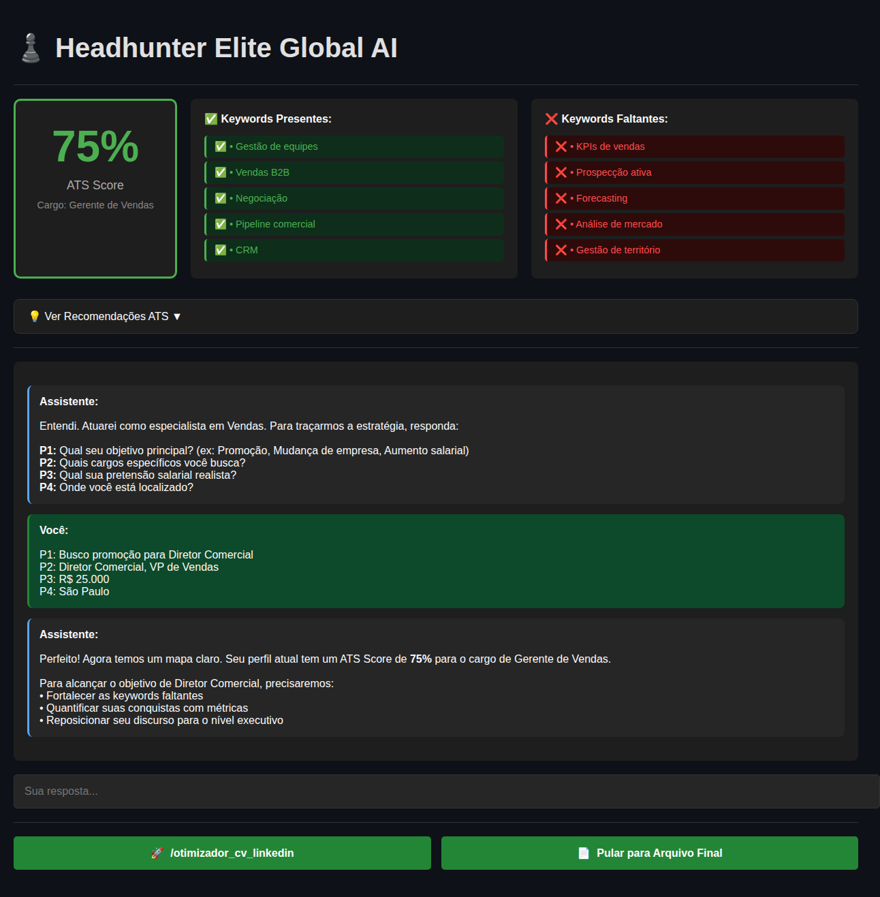

# 📊 Nobile Career Strategy - Layout da Aplicação

## Visão Geral

A aplicação combina um **Dashboard de ATS Score** sempre visível no topo com um **Consultor Interativo** baseado em chat logo abaixo.



---

## 🎨 Estrutura da Interface

### 1. **Cabeçalho**
```
♟️ Headhunter Elite Global AI
```
- Título principal da aplicação
- Sempre visível no topo

---

### 2. **Dashboard ATS Score** (Sempre Visível)

Aparece automaticamente após o upload do CV, permanecendo fixo no topo durante toda a sessão.

#### Layout em 3 Colunas:

#### **Coluna 1: Score Card**
```
┌─────────────────────┐
│       75%          │ ← Score em destaque (grande)
│    ATS Score       │ ← Label
│ Cargo: Gerente...  │ ← Cargo detectado
└─────────────────────┘
```
- **Cores dinâmicas:**
  - Verde (#4CAF50): Score ≥ 70%
  - Laranja (#FF9800): Score ≥ 50%
  - Vermelho (#FF5252): Score < 50%

#### **Coluna 2: Keywords Presentes** ✅
```
✅ Keywords Presentes:
✅ • Gestão de equipes
✅ • Vendas B2B
✅ • Negociação
✅ • Pipeline comercial
✅ • CRM
```
- Lista de 5-10 palavras-chave encontradas no CV
- Fundo verde escuro com ícone ✅

#### **Coluna 3: Keywords Faltantes** ❌
```
❌ Keywords Faltantes:
❌ • KPIs de vendas
❌ • Prospecção ativa
❌ • Forecasting
❌ • Análise de mercado
❌ • Gestão de território
```
- Lista de 5-10 palavras-chave ausentes
- Fundo vermelho escuro com ícone ❌

#### **Recomendações** (Colapsável) 💡
```
💡 Ver Recomendações ATS ▼
```
- Seção expansível com 3 recomendações práticas
- Aparece logo abaixo do dashboard

---

### 3. **Área de Chat Interativo**

Conversação natural com o assistente AI:

```
┌─────────────────────────────────────────┐
│ Assistente:                             │
│ Entendi. Atuarei como especialista em  │
│ Vendas. Para traçarmos a estratégia... │
└─────────────────────────────────────────┘

┌─────────────────────────────────────────┐
│ Você:                                   │
│ P1: Busco promoção para Diretor...     │
└─────────────────────────────────────────┘
```

- **Mensagens do Assistente:** Fundo cinza escuro
- **Mensagens do Usuário:** Fundo verde escuro (#0d4a2b)
- **Input de texto:** Barra na parte inferior para respostas

---

### 4. **Menu de Comandos** (Após Diagnóstico)

Aparece após completar as perguntas P1-P4:

```
┌──────────────────────────┬──────────────────────────┐
│ 🚀 /otimizador_cv_linkedin│ 📄 Pular para Arquivo Final│
└──────────────────────────┴──────────────────────────┘
```

- **Botão 1:** Inicia otimização completa (SEO, Métricas, Curadoria, Engenharia, Arquivo Final)
- **Botão 2:** Pula direto para geração do arquivo final
- **Cor dos botões:** Verde (#238636) com hover mais claro (#2ea043)

---

## 🔄 Fluxo de Uso

### Fase 1: Upload
1. Usuário faz upload do CV (PDF)
2. **Automático:**
   - Extração de texto
   - Detecção do cargo
   - Cálculo do ATS Score
3. Dashboard ATS aparece no topo

### Fase 2: Diagnóstico
1. Chat inicia com perguntas P1-P4
2. Dashboard ATS permanece visível no topo
3. Usuário responde no chat

### Fase 3: Menu
1. Após responder P1-P4, menu de comandos aparece
2. Dashboard ATS continua visível
3. Usuário escolhe próxima ação

### Fase 4: Execução
1. Otimização guiada ou geração direta
2. Dashboard ATS sempre presente
3. Chat continua ativo

---

## 🎯 Características Principais

### ✨ Auto-Cálculo ATS
- Não requer ação manual
- Ocorre instantaneamente no upload
- Cargo detectado automaticamente via AI

### 📊 Dashboard Persistente
- Sempre visível durante toda a sessão
- Métricas em tempo real
- Referência constante para o usuário

### 💬 Chat Consultivo
- Fluxo interativo pausado
- Tom estratégico e construtivo
- Validação em cada etapa

### 🎨 Visual Profissional
- Tema escuro (#0E1117)
- Cores institucionais verdes
- Layout limpo e organizado

---

## 📱 Responsividade

A aplicação se adapta a diferentes tamanhos de tela:
- **Desktop:** Layout 3 colunas no dashboard
- **Tablet/Mobile:** Colunas empilhadas verticalmente

---

## 🔧 Tecnologias

- **Frontend:** Streamlit
- **AI:** OpenAI GPT-4o
- **PDF:** pdfplumber
- **Estilo:** CSS customizado inline
